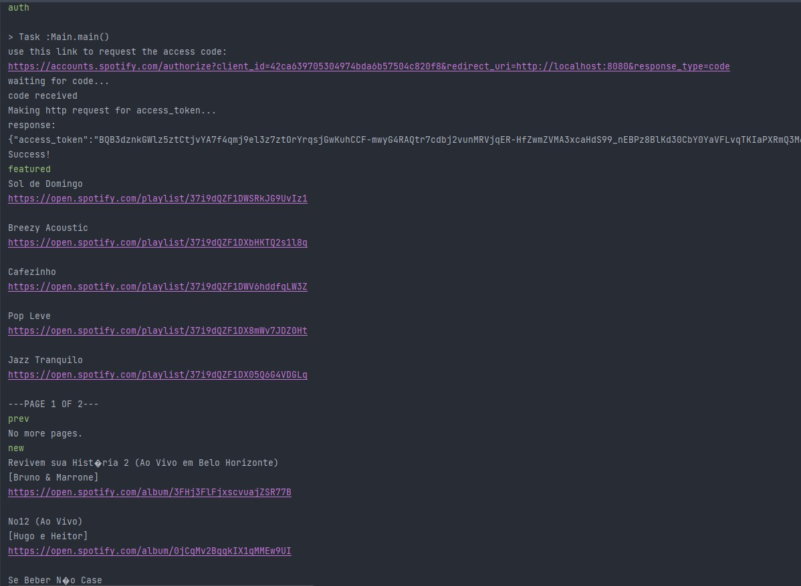

# music-advisor

This project is a command-line application that that makes preference-based suggestions and shares links to new releases and featured playlists via [Spotify Web API](https://developer.spotify.com/documentation/web-api/).

### Features
- OAuth2 authentication
- Get authorization from Spotify to access the API
- View featured playlists, playlists by category and new album releases based on user preferences

### How to run
In order to test the app, you'll need:

- Java 17
- Gradle
- A Spotify account

Then, follow the steps below:

##### **1**)
Head to [Spotify for Developers](https://developer.spotify.com/dashboard/login) website and create a test app.

There, you will be able to get CLIENT_ID and CLIENT_SECRET, which are needed to test the project.

Also, you will need to add the following redirect URI to your app: http://localhost:8080. 

To do that, head to the _Edit Settings_ section of your app and add http://localhost:8080 to the _Redirect URIs_ field.

##### **2**)
Clone this repository, build and run the project using Gradle.

##### **3**)
Head to the `MusicAdvisorConfig` class (inside config package) and update the CLIENT_ID and CLIENT_SECRET with valid values (the ones you got from Spotify for Developers website).

##### **4**)
Run the program from the `Main` class and input _auth_ command to get an authorization link.

Once you have authorized the app, you will be able to access the following commands:

- featured – View the featured playlists
- new – View the new playlists
- categories – View playlists by category
- playlists [playlist_name] – Search for specific playlists (replace [playlist_name] with the name of the playlist you are searching for)
- prev/next – You can use these to navigate through pages (each command shows a limited amount of items per page)
- exit – Exit the application

**Example:**

### Learning outcomes
When doing this project, I had to:
- Use OAuth2 protocol to authenticate users
- Use the Spotify Web API to get information about playlists, albums, artists and categories based on user preferences
- Use the `HttpClient` class to make HTTP requests
- Parse JSON responses from the API
- Use MVC pattern to separate the application into three layers: model, view and controller
- Apply strategy pattern to handle different types of inputs
- Paginate results retrieved from the Spotify API

### Contact
If you have any questions or suggestions, feel free to contact me at [LinkedIn](https://www.linkedin.com/in/douglasdotv).
