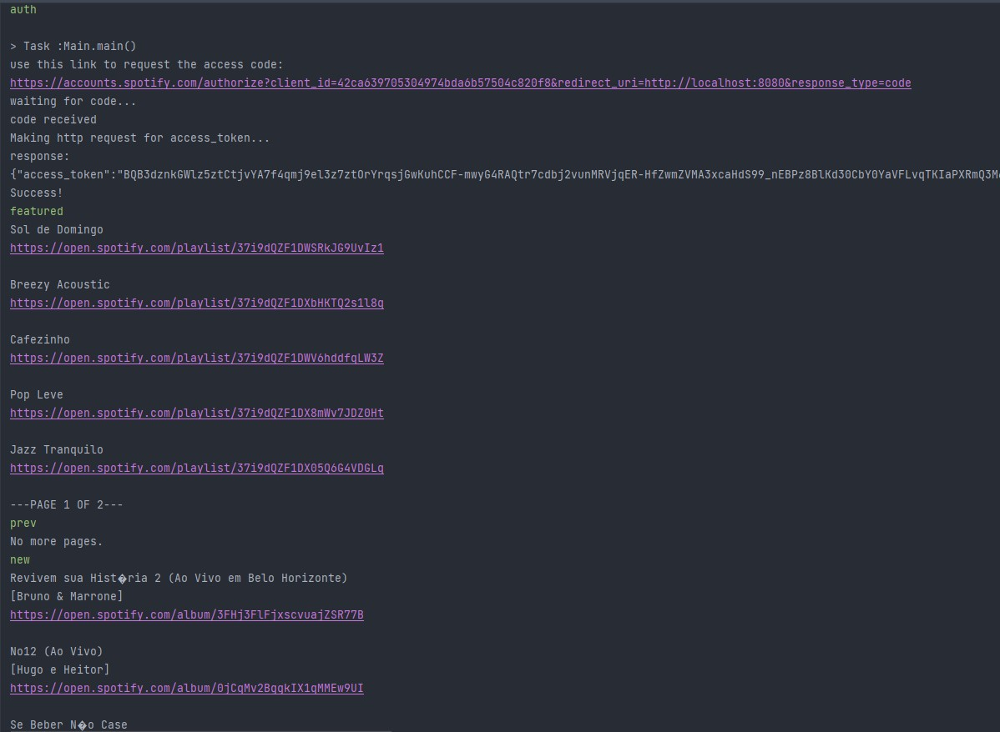

# music-advisor

Este é um aplicativo que fornece aos usuários acesso a recomendações de diferentes álbuns e playlists por meio da [API do Spotify](https://developer.spotify.com/documentation/web-api/).

### Funcionalidades
- Autenticação via OAuth2
- Obter autorização do Spotify para acessar a API
- Ver playlists em destaque, playlists por categoria e novos lançamentos de álbuns com base nas preferências do usuário

**Exemplo:**

### Como rodar
Para testar o aplicativo, você precisará de:

- Java 17
- Gradle
- Uma conta de usuário do Spotify

Em seguida, siga os passos abaixo:

##### **1**)
Acesse o site [Spotify for Developers](https://developer.spotify.com/dashboard/login) e crie um aplicativo teste.

Na página dele, é possível obter o CLIENT_ID e o CLIENT_SECRET, necessários para testar o projeto.

Além disso, será necessário adicionar a seguinte redirect URI ao seu aplicativo: http://localhost:8080.

Para fazer isso, acesse a seção _Edit Settings_ do aplicativo e adicione http://localhost:8080 ao campo _Redirect URIs_.

##### **2**)
Clone este repositório, gere a build do projeto e rode–o usando o Gradle.

##### **3**)
Em seguida, acesse a classe `MusicAdvisorConfig` (dentro do pacote config) e atualize o CLIENT_ID e o CLIENT_SECRET com valores válidos (os obtidos no site Spotify for Developers ao criar um aplicativo teste).

##### **4**)
Execute o programa a partir da classe `Main` e digite o comando _auth_ para obter um link de autorização.

Uma vez que você tenha autorizado o aplicativo, obterá acesso aos os seguintes comandos:

- featured – Visualizar as playlists em destaque
- new – Visualizar os novos lançamentos
- categories – Visualizar playlists por categoria
- playlists [playlist_name] – Buscar playlists específicas (substitua [playlist_name] pelo nome da playlist que você está procurando)
- prev/next – Esses comandos permitem a navegação pelas diferentes páginas de conteúdo (cada um dos comandos anteriores exibe uma quantidade limitada de itens por página)
- exit – Sair do aplicativo

### O que aprendi
Durante a realização deste projeto, foi necessário: 
- Utilizar o protocolo OAuth2 para autenticar usuários
- Utilizar a API do Spotify Web para obter informações sobre playlists, álbuns, artistas e categorias com base nas preferências do usuário
- Utilizar a classe `HttpClient` para fazer requisições HTTP
- Realizar o parsing de JSONs obtidos via requisições HTTP
- Aplicar o padrão MVC para separar a aplicação em três camadas: model, view e controller
- Aplicar o padrão _strategy_ para lidar com diferentes tipos de _inputs_ do usuário
- Paginar resultados de requisições HTTP feitas à API do Spotify

### Contato
Se houver quaisquer dúvidas ou sugestões, sinta-se à vontade para entrar em contato comigo via [LinkedIn](https://www.linkedin.com/in/douglasdotv/).
